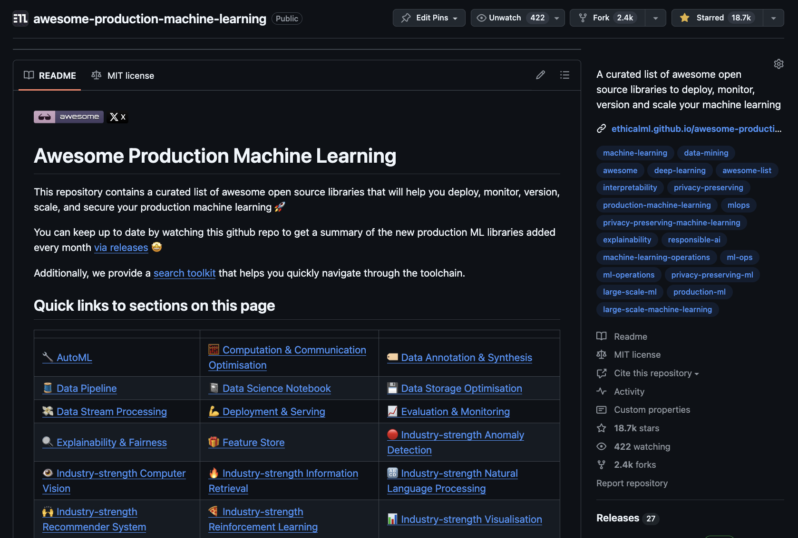

# Awesome Production Generative Artificial Intelligence

This repository contains a curated list of awesome open source libraries that will help you deploy, monitor, version, scale, and secure your production generative artificial intelligence systems and applications 🚀

You can keep up to date by watching this github repo to get a summary of the new production ML libraries added every month [via releases](https://github.com/EthicalML/awesome-production-genai/releases) 🤩

## Quick links to sections on this page

| | | | |
|-|-|-|-|
| [🤖 Agent Development](#agent-development) | [☎️ Context Management](#context-management) | [🎞️ Memory Management](#memory-management) | [🚀 Model Deployment](#model-deployment) |
| [🦺 Model Security](#model-security) | [🎮 Prompt Engineering](#prompt-engineering) | [🎨 Visual Engine](#visual-engine) |

## Contributing to the list

Please review our [CONTRIBUTING.md](https://github.com/EthicalML/awesome-production-genai/blob/main/CONTRIBUTING.md) requirements when submitting a PR to help us keep the list clean and up-to-date - thank you to the community for supporting its steady growth 🚀

<picture>
  <source
    media="(prefers-color-scheme: dark)"
    srcset="
      https://api.star-history.com/svg?repos=EthicalML/awesome-production-genai&type=Date&theme=dark
    "
  />
  <source
    media="(prefers-color-scheme: light)"
    srcset="
      https://api.star-history.com/svg?repos=EthicalML/awesome-production-genai&type=Date
    "
  />
  
</picture>

## Want to receive recurrent updates on this repo and other advancements?

<table>
  <tr>
    <td width="30%">
         You can join the <a href="https://ethical.institute/mle.html">Machine Learning Engineer</a> newsletter. Join over 70,000 ML professionals and enthusiasts who receive weekly curated articles & tutorials on production Machine Learning.
    </td>
    <td width="70%">
        
    </td>
  </tr>
  <tr>
    <td width="30%">
         Also check out the <a href="https://github.com/EthicalML/awesome-artificial-intelligence-regulation">Awesome Production Machine Learning </a> List, where we aim to provide a curated list of awesome open source libraries to deploy, monitor, version and scale your machine learning.
    </td>
    <td width="70%">
        
    </td>
  </tr>
</table>

# Main Content

## Agent Development

* [AgentAPI](https://github.com/coder/agentapi)  - Control Claude Code, AmazonQ, Opencode, Goose, Aider, Gemini, GitHub Copilot, Sourcegraph Amp, Codex, Auggie, and Cursor CLI with an HTTP API.
* [AgentKit](https://github.com/inngest/agent-kit)  - AgentKit help agent developers build multi-agent networks with deterministic routing and rich tooling via MCP.
* [AgentOps](https://github.com/AgentOps-AI/agentops)  - AgentOps helps developers build, evaluate, and monitor AI agents from prototype to production.
* [Agents](https://github.com/livekit/agents)  - Agents allows users to build AI-driven server programs that can see, hear, and speak in realtime.
* [AgentScope](https://github.com/modelscope/agentscope)  - AgentScope is a multi-agent platform designed to empower developers to build multi-agent applications with large-scale models.
* [AgentStack](https://github.com/AgentOps-AI/AgentStack)  - AgentStack scaffolds your agent stack.
* [AIOpsLab](https://github.com/microsoft/AIOpsLab)  - AIOpsLab is a holistic framework to enable the design, development, and evaluation of autonomous AIOps agents.
* [any-agent](https://github.com/mozilla-ai/any-agent)  - any-agent is a Python library providing a single interface to different agent frameworks.
* [AutoGen](https://github.com/microsoft/autogen)  - AutoGen is an open-source framework for building AI agent systems.
* [Chidori](https://github.com/ThousandBirdsInc/chidori)  - Chidori is a reactive runtime that supports building robust AI agents using languages like Node.js, Python, and Rust, with a focus on reactivity and observability in agent workflows.
* [Composio](https://github.com/ComposioHQ/composio)  - Composio equip's your AI agents & LLMs with 100+ high-quality integrations via function calling.
* [Concordia](https://github.com/google-deepmind/concordia)  - Concordia is a library to facilitate construction and use of generative agent-based models to simulate interactions of agents in grounded physical, social, or digital space. 
* [CrewAI](https://github.com/crewAIInc/crewAI)  - CrewAI is a cutting-edge framework for orchestrating role-playing, autonomous AI agents.
* [deepagents](https://github.com/langchain-ai/deepagents)  - deepagents is a Python package that implements these in a general purpose way so that you can easily create a Deep Agent for your application.
* [Eko](https://github.com/FellouAI/eko)  - Eko is a production-ready JavaScript framework that enables developers to create reliable agents, from simple commands to complex workflows.
* [IntellAgent](https://github.com/plurai-ai/intellagent)  - IntellAgent is an advanced multi-agent framework that transforms the evaluation and optimization of conversational agents.
* [kagent](https://github.com/kagent-dev/kagent)  - kagent is a Kubernetes native framework for building AI agents.
* [LangGraph](https://github.com/langchain-ai/langgraph)  - LangGraph is a library for building stateful, multi-actor applications with LLMs, used to create agent and multi-agent workflows.
* [Modelscope-Agent](https://github.com/modelscope/modelscope-agent)  - Modelscope-Agent is a customizable and scalable agent framework.
* [n8n](https://github.com/n8n-io/n8n)  - n8n is a workflow automation platform that gives technical teams the flexibility of code with the speed of no-code.
* [OpenAGI](https://github.com/agiresearch/OpenAGI)  - OpenAGI is used as the agent creation package to build agents for AIOS.
* [OpenAI Agents SDK](https://github.com/openai/openai-agents-python)  - The OpenAI Agents SDK is a lightweight yet powerful framework for building multi-agent workflows. It is provider-agnostic, supporting the OpenAI Responses and Chat Completions APIs, as well as 100+ other LLMs.
* [PydanticAI](https://github.com/pydantic/pydantic-ai)  - PydanticAI is a Python agent framework designed to make it less painful to build production grade applications with Generative AI.
* [smolagents](https://github.com/huggingface/smolagents)  - smolagents is a library that enables you to run powerful agents in a few lines of code. 
* [Swarm](https://github.com/openai/swarm)  - Swarm is an educational framework exploring ergonomic, lightweight multi-agent orchestration.
* [Swarms](https://github.com/kyegomez/swarms)  - Swarms is an enterprise grade and production ready multi-agent collaboration framework that enables you to orchestrate many agents to work collaboratively at scale to automate real-world activities.
* [TensorZero](https://github.com/tensorzero/tensorzero)  - TensorZero is an open-source framework for building production-grade LLM applications. It unifies an LLM gateway, observability, optimization, evaluations, and experimentation.

## Context Management

* [A2A](https://github.com/a2aproject/A2A)  - Agent2Agent (A2A) protocol addresses a critical challenge in the AI landscape: enabling gen AI agents, built on diverse frameworks by different companies running on separate servers, to communicate and collaborate effectively - as agents, not just as tools.
* [agents.json](https://github.com/wild-card-ai/agents-json)  - The agents.json Specification is an open specification that formally describes contracts for API and agent interactions, built on top of the OpenAPI standard.
* [ANP](https://github.com/agent-network-protocol/AgentNetworkProtocol)  - AgentNetworkProtocol (ANP) is an open-source communication standard designed to enable seamless connectivity and collaboration between intelligent agents, positioning itself as the foundational protocol for agent-to-agent interactions in the emerging AI ecosystem.
* [FastMCP](https://github.com/jlowin/fastmcp)  - FastMCP is an open-source Python framework designed to simplify the creation and management of servers and clients that adhere to the Model Context Protocol (MCP).
* [MCP Inspector](https://github.com/modelcontextprotocol/inspector)  - MCP inspector is a developer tool for testing and debugging MCP servers.
* [mcp-scan](https://github.com/invariantlabs-ai/mcp-scan)  - mcp-scan is an MCP security scanning tool for local and remote MCP Servers.

## Memory Management

* [Graphiti](https://github.com/getzep/graphiti)  - Graphiti is a framework for building and querying temporally-aware knowledge graphs, specifically tailored for AI agents operating in dynamic environments.
* [LangMem](https://github.com/langchain-ai/langmem)  - LangMem provides ways to extract meaningful details from chats, store them, and use them to improve future interactions.
* [Mem0](https://github.com/mem0ai/mem0)  - Mem0 ("mem-zero") enhances AI assistants and agents with an intelligent memory layer, enabling personalized AI interactions. It remembers user preferences, adapts to individual needs, and continuously learns over time—ideal for customer support chatbots, AI assistants, and autonomous systems.
* [MemOS](https://github.com/MemTensor/MemOS)  - MemOS is an operating system for Large Language Models (LLMs) that enhances them with long-term memory capabilities. It allows LLMs to store, retrieve, and manage information, enabling more context-aware, consistent, and personalized interactions.
* [supermemory](https://github.com/supermemoryai/supermemory)  - supermemory intelligently extracts information from your conversations and apps and pieces together connections between memories to deliver seamless user experience.
* [Zep](https://github.com/getzep/zep)  - Zep is a memory platform for AI agents that learns from user interactions and business data.

## Model Deployment
* [GenAI Processors](https://github.com/google-gemini/genai-processors)  - GenAI Processors is a lightweight Python library that enables efficient, parallel content processing.
* [SGLang](https://github.com/sgl-project/sglang)  - SGLang is a fast serving framework for large language models and vision language models.

## Model Security
* [Agentic Radar](https://github.com/splx-ai/agentic-radar)  - Agentic Radar is a security scanner for LLM agentic workflows for potential vulnerabilities.
* [DeepTeam](https://github.com/msoedov/agentic_security)  - Agentic Security is a vulnerability scanner for agentic workflows, protecting AI systems from jailbreaks, fuzzing, and multimodal attacks.
* [DeepTeam](https://github.com/confident-ai/deepteam)  - DeepTeam is a simple-to-use, open-source LLM red teaming framework, for penetration testing and safe guarding large-language model systems.
* [Prompt Fuzzer](https://github.com/prompt-security/ps-fuzz)  - Prompt Fuzzer is a security tool that tests GenAI applications to find vulnerabilities, such as prompt injection and other attacks.
* [Purple Llama](https://github.com/meta-llama/PurpleLlama)  - Purple Llama is a set of tools to assess and improve LLM security for building responsible GenAI models.

## Prompt Engineering

* [ChainForge](https://github.com/ianarawjo/ChainForge)  - ChainForge is an open-source visual programming environment for battle-testing prompts to LLMs. Compare across models, prompts, and prompt parameters using built-in visualizations.
* [DSPy](https://github.com/stanfordnlp/dspy)  - DSPy is the framework for programming—not prompting—language models. It allows you to iterate fast on building modular AI systems and offers algorithms for optimizing prompts and weights.
* [ell](https://github.com/MadcowD/ell)  - ell is a language model programming library that treats prompts as programs. Features automatic versioning, serialization, and rich tooling for prompt engineering with Ell Studio for visualization.
* [Latitude](https://github.com/latitude-dev/latitude-llm)  - Latitude is the open-source prompt engineering platform to build, evaluate, and refine prompts with AI. Features prompt management, playground testing, AI gateway, and evaluations.
* [PromptIDE](https://x.ai/blog/prompt-ide) - PromptIDE by xAI is an integrated development environment for prompt engineering and interpretability research, providing transparent access to Grok-1 with rich analytics and Python SDK support.
* [PromptLayer](https://github.com/MagnivOrg/prompt-layer-library)  - PromptLayer helps developers maintain a log of their prompts and LLM API requests. Track, debug, and replay completions with a middleware approach.
* [PromptSource](https://github.com/bigscience-workshop/promptsource)  - PromptSource is a toolkit for creating, sharing and using natural language prompts. Contains a growing collection of prompts (P3: Public Pool of Prompts) written in Jinja templating language.
* [Prompty](https://github.com/microsoft/prompty)  - Prompty makes it easy to create, manage, debug, and evaluate LLM prompts for AI applications. An asset class and format for LLM prompts designed to enhance observability, understandability, and portability.

## Visual Engine

* [Chat UI](https://github.com/huggingface/chat-ui)  - Chat UI is an open-source web application framework that provides the frontend interface and backend infrastructure for building conversational AI chatbots, serving as the codebase behind their HuggingChat platform.
* [ComfyUI](https://github.com/comfyanonymous/ComfyUI)  - ComfyUI is a node-based interface and inference engine for generative AI, specifically designed to work with Stable Diffusion and other AI models. It allows users to create complex workflows for image, video, and other content generation through a visual, graph-like interface.
